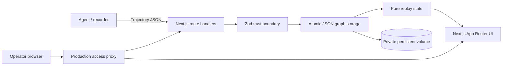

# Trajectory Arena Architecture

## System boundary

Trajectory Arena is a single-operator inspection and evaluation application. Producers create trajectory JSON outside the application; Trajectory Arena validates, persists, replays, and compares it. The application never executes imported commands or source code.



## Components

- `src/proxy.ts` — production authentication, request IDs, fail-closed configuration, and public health exception.
- `src/app/api/**` — bounded HTTP parsing, same-origin mutation policy, typed status/error mapping, and route contracts.
- `src/lib/validation.ts` — strict schemas, discriminated step union, field/collection limits, timestamps, finite numbers, IDs, pagination, and schema-version checks.
- `src/lib/storage.ts` — entity graph normalization, local persistence, writer exclusion, rollback, corruption handling, listing, import/export, and leaderboard ordering.
- `src/lib/replay.ts` — replay panel selection, checkpoint-aware file reconstruction, and bounded progress calculations.
- `src/app/**` — server/client page boundaries and accessible user workflows.

## Trust boundaries

### HTTP boundary

Request bodies are accepted only as `application/json`, capped at 10 MiB before persistence, and parsed once. Mutation routes reject cross-site browser requests and enforce read-only mode. Production access requires Basic credentials unless the operator explicitly enables unauthenticated mode.

### Identifier and filesystem boundary

Entity IDs are limited to 128 ASCII letters, numbers, underscores, and hyphens. Separators, dot segments, absolute paths, control characters, and reserved filenames cannot reach path construction. Entity reads use `O_NOFOLLOW`; collection and directory symbolic links are rejected.

### Schema boundary

TypeScript interfaces are not treated as validation. Every incoming and persisted object passes a strict Zod schema. Step indexes must be contiguous and each step's data must match its discriminant. Token totals, timestamps, statuses, schema versions, numeric bounds, and aggregate sizes are validated.

## Persistence model

The data directory contains three source-of-truth collections:

```text
<data>/
├── tasks/<task-id>.json
├── trajectories/<trajectory-id>.json
└── runs/<run-id>.json
```

There is no mutable index file. Lists are derived from validated entity files, eliminating index/entity crash divergence.

Each write:

1. validates and normalizes the complete graph;
2. acquires a data-directory writer lock with PID, process-start-time, and random ownership token;
3. snapshots affected entity bytes into a durable transaction journal;
4. writes a same-directory unique temporary file;
5. syncs the file;
6. atomically renames it;
7. syncs the directory;
8. removes the journal after every graph write succeeds;
9. restores snapshots after an in-process failure or at the next startup after an interrupted process;
10. releases only the lock whose ownership token matches the current writer.

A live lock causes a conflict response instead of lost updates. Linux process start time distinguishes a live owner from PID reuse; legacy/incomplete metadata is handled conservatively. Stale-lock reclamation is serialized, and lock release verifies ownership before unlinking. This model provides durable single-host, single-writer behavior; it does **not** make JSON a distributed database.

Deleting a trajectory deletes its linked run in the same rollback-protected operation. Deleting a task is blocked while any trajectory or run references it.

## Import and seeding

A trajectory import persists its embedded task, normalized trajectory, and derived run together. Valid token counts and duration are preserved while derivable structural counts are recomputed.

Bundled examples use deterministic IDs and are stored as one batch transaction. Seeding is explicit and disabled by default in production.

## Replay

File state begins with task starter files. The reducer applies edits until the selected step and starts from the nearest prior complete checkpoint to bound work. Checkpoints replace state rather than merge it. Empty file contents are retained, and delete operations remove files.

The browser windows long timelines around the selected step and truncates very large text panels for rendering safety; full validated data remains available in JSON export.

## Arena scoring

The authoritative status is the trajectory outcome:

- success: 100;
- partial: 50;
- all other statuses: 0.

Ordering is deterministic: score descending, duration ascending, tokens ascending, steps ascending, then model name. The UI documents this policy and exposes the raw factors. It does not claim a statistically normalized benchmark score.

## Deployment model

Production requires:

- one Node.js process;
- one absolute private persistent data directory;
- TLS termination;
- configured Basic credentials or an explicit isolated-mode override;
- reverse-proxy rate/body limits;
- backup and restore procedures.

The application intentionally fails closed when production storage or access control is missing. Multiple replicas and shared/network filesystems are unsupported in version 1.0.

## Observability

`GET /api/health` validates storage readability/writability and entity integrity while reporting application/schema versions and counts. Corruption and unexpected server failures are logged to stderr and return generic client errors. Reverse-proxy access logs provide request status, latency, and rate visibility.

## Quality architecture

- Biome formatting/static analysis.
- TypeScript no-emit checking.
- Vitest unit, validation, API, route, authentication, replay, and fault-injected storage tests.
- Coverage thresholds: 80% lines/statements, 90% functions, 68% branches.
- Standalone production smoke test.
- Playwright Chromium workflow tests.
- Production/full npm vulnerability gates.
- Hardened container build in CI.

See [OPERATIONS.md](OPERATIONS.md) for deployment and recovery and [SECURITY.md](SECURITY.md) for the threat model.
