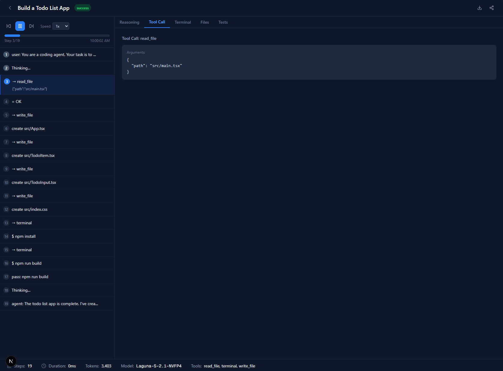

# Trajectory Arena

<div align="center">
  
</div>

> Visualize, replay, and evaluate agentic coding trajectories.

Trajectory Arena is an open-source tool for recording, replaying, and
evaluating agentic coding sessions. Watch AI models work through coding tasks
step-by-step, inspect file diffs in real time, and compare multiple runs on
the same task.

Built for local AI researchers, Hermes/OpenClaw users, and anyone curious
about how coding agents think.

## Screenshots

### Home — Trajectory List


### Trajectory Replay


## Features

### Trajectory Capture & Storage
- Clean, versioned JSON schema (v1.0.0)
- Logs: reasoning, tool calls, file edits with diffs, terminal output, test results
- Import from files or API/webhook
- Local-first storage (JSON files on disk)

### Interactive Trajectory Replay
- Timeline scrubber with play/pause, speed control, step-by-step navigation
- Live code editor view with animated diffs
- Side panels: reasoning, tool call, terminal output, test results
- Visual indicators for success/failure at each step

### Arena Mode
- Task definition interface (title, description, success criteria, test commands)
- Leaderboard comparison across multiple runs
- Automatic trajectory capture

### Visualization & Polish
- Modern, dark, high-contrast UI
- Smooth animations for timeline movement and code changes
- Metric cards (steps, tools, files, tokens, time)
- Export: trajectory JSON download

## Quick Start

```bash
# Clone the repository
git clone https://github.com/smfworks/trajectory-arena.git
cd trajectory-arena

# Install dependencies
npm install

# Start the development server
npm run dev

# Open http://localhost:3000
```

## Project Structure

```
trajectory-arena/
├── src/
│   ├── app/
│   │   ├── api/              # REST API routes
│   │   ├── trajectories/     # List + detail/replay pages
│   │   ├── arena/            # Task definition + leaderboard
│   │   ├── import/           # Trajectory import page
│   │   ├── docs/             # Documentation
│   │   └── seed/             # Example data seeder
│   ├── lib/
│   │   ├── schema.ts         # Trajectory schema (v1.0.0)
│   │   ├── storage.ts        # JSON file storage
│   │   └── examples.ts       # Example trajectory generator
│   └── public/               # Static assets
├── ARCHITECTURE.md           # Architecture documentation
├── README.md
└── package.json
```

## Architecture

See [ARCHITECTURE.md](ARCHITECTURE.md) for detailed architecture documentation.

## Trajectory Schema

The trajectory format is versioned and documented in [`src/lib/schema.ts`](src/lib/schema.md).

**Version:** 1.0.0

Key entities:
- `Trajectory` — Top-level container with metadata, steps, and outcome
- `TrajectoryStep` — Individual step (reasoning, tool call, file edit, etc.)
- `TaskDefinition` — Task specification for arena mode

## Customization

### Adding a New Step Type
1. Extend `StepData` in `src/lib/schema.ts`
2. Add a case in the step renderer in `src/app/trajectories/[id]/page.tsx`
3. Add visual styling in `globals.css`

### Custom Storage Backend
The storage layer (`src/lib/storage.ts`) uses JSON files by default.
To use a different backend (SQLite, PostgreSQL, etc.):
1. Implement the same interface (`saveTrajectory`, `loadTrajectory`, etc.)
2. Replace the implementations in `src/lib/storage.ts`

### UI Theme
The dark theme is defined in `src/app/globals.css` using CSS variables.
Modify the `--color-*` variables to customize the color scheme.

## API Reference

### Trajectories
- `GET /api/trajectories` — List all trajectories
- `GET /api/trajectories/:id` — Get a single trajectory
- `POST /api/trajectories` — Save a new trajectory
- `DELETE /api/trajectories/:id` — Delete a trajectory
- `POST /api/trajectories/:id/export` — Export to JSON

### Tasks
- `GET /api/tasks` — List all tasks
- `POST /api/tasks` — Create a new task
- `GET /api/tasks/:id` — Get a single task

### Arena
- `GET /api/runs?taskId=xxx` — List runs for a task
- `GET /api/leaderboard?taskId=xxx` — Get leaderboard for a task

### Import/Seed
- `POST /api/import` — Import a trajectory from JSON
- `POST /api/seed` — Seed example data

## Contributing

See [CONTRIBUTING.md](CONTRIBUTING.md) for development guidelines.

## License

MIT License — see [LICENSE](LICENSE) for details.

## Acknowledgments

- Built with [Next.js](https://nextjs.org/) and [Turbopack](https://turbo.build/pack)
- Icons from [Lucide React](https://lucide.dev/)
- Storage powered by [sql.js](https://sql.js.org/)
- Part of the [SMF Works Project](https://smfworks.com/)
