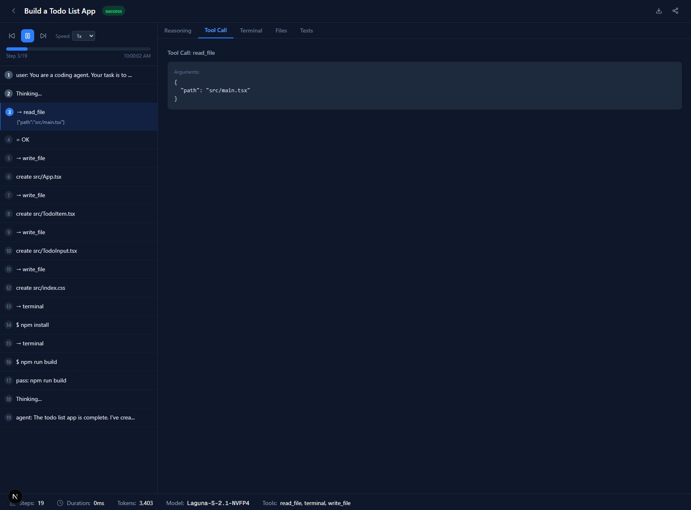

# Trajectory Arena

Trajectory Arena is a local-first Next.js application for importing, validating, replaying, and comparing agentic coding trajectories. It is designed for a single operator who needs to inspect reasoning messages, tool activity, terminal output, file state, tests, and final outcomes without sending session data to an external service.



## Capabilities

- Strict, versioned trajectory schema (`1.0.0`) with runtime Zod validation.
- Bounded JSON ingestion and bounded list pagination.
- Replay panels for reasoning/messages, tools, terminal output, reconstructed files, and tests.
- Keyboard replay controls, adjustable speed, responsive layouts, and accessible error/loading/empty states.
- Task definitions and deterministic leaderboard ordering for imported runs.
- JSON import and export.
- Local JSON storage with atomic writes, filesystem sync, ownership-checked cross-process writer exclusion, durable transaction-journal recovery, corruption detection, symbolic-link rejection, and graph rollback.
- Production Basic authentication, same-origin mutation checks, read-only mode, explicit example seeding, security headers, and storage-aware health checks.
- Unit, API, storage, coverage, standalone smoke, Playwright, dependency audit, and container build gates in CI.

## Scope

Trajectory Arena **does not execute agents or task commands**. It visualizes and evaluates records produced elsewhere.

The supported 1.0 production topology is **one application process on one private persistent volume**. It is not a multi-user authorization service and it does not support multiple replicas sharing the JSON directory. See [OPERATIONS.md](OPERATIONS.md).

## Requirements

- Node.js `>=22.12.0` (CI and container use Node `24.14.0`).
- npm `11.9.0`.
- Linux is the supported production container platform.

## Development quick start

```bash
git clone https://github.com/smfworks/trajectory-arena.git
cd trajectory-arena
npm ci
npm run dev
```

Open `http://localhost:3000`. Development mode allows local unauthenticated access. Example data is loaded only when you explicitly use `/seed`.

## Production quick start

```bash
cp .env.example .env
# Set TRAJECTORY_BASIC_AUTH_PASSWORD in .env.
docker compose up --build -d
curl --fail http://127.0.0.1:3000/api/health
```

The Compose deployment binds to loopback and persists data in `trajectory-data`. Put a TLS reverse proxy in front of it for remote access. Full deployment, backup, restore, monitoring, and rollback instructions are in [OPERATIONS.md](OPERATIONS.md).

## Quality gates

```bash
npm run lint
npm run typecheck
npm run test:coverage
npm run build
npm run test:e2e
npm run audit
```

`npm run check` runs static analysis, type checking, coverage, build, and vulnerability audits. Playwright is separate because it requires a Chromium installation:

```bash
npx playwright install chromium
npm run test:e2e
```

## Data model

A trajectory contains:

- schema and entity identifiers;
- an embedded task definition;
- model, environment, timing, and token metadata;
- contiguous typed steps;
- a final status, summary, and test results;
- an optional run ID used for Arena ranking.

Saving or importing a trajectory persists its task, trajectory, and run as one coherent graph. The operation is validated before any write and rolled back if a later entity write fails.

## API

All responses are `Cache-Control: no-store`. Mutation requests require same-origin browser context and production authentication.

| Method | Path | Purpose |
| --- | --- | --- |
| `GET` | `/api/health` | Version and storage health |
| `GET` | `/api/trajectories` | List summaries (`limit` defaults to 100; `offset`, `status`, `model`) |
| `POST` | `/api/trajectories` | Validate and persist a trajectory graph |
| `GET` | `/api/trajectories/:id` | Read one trajectory |
| `DELETE` | `/api/trajectories/:id` | Delete a trajectory and its linked run |
| `GET` | `/api/trajectories/:id/export` | Download a `TrajectoryExport` JSON document |
| `POST` | `/api/import` | Import a trajectory or export wrapper |
| `GET` | `/api/tasks` | List task summaries |
| `POST` | `/api/tasks` | Create or update a task |
| `GET` | `/api/tasks/:id` | Read one task |
| `DELETE` | `/api/tasks?id=:id` | Delete an unreferenced task |
| `GET` | `/api/runs?taskId=:id` | List run summaries |
| `GET` | `/api/leaderboard?taskId=:id` | Rank runs for one task |
| `POST` | `/api/seed` | Explicitly load deterministic examples when enabled |

The in-app `/docs` page provides a compact runtime contract. TypeScript domain definitions are in [`src/lib/schema.ts`](src/lib/schema.ts); strict boundary validation is in [`src/lib/validation.ts`](src/lib/validation.ts).

## Repository structure

```text
src/app/                 Next.js pages and route handlers
src/components/          Shared UI components
src/lib/schema.ts        Public TypeScript domain model
src/lib/validation.ts    Runtime schemas and limits
src/lib/storage.ts       Durable local JSON storage
src/lib/replay.ts        Pure replay-state helpers
tests/                   Unit, integration, and browser tests
scripts/                 Standalone preparation and runtime smoke scripts
.github/workflows/       Release-blocking CI
```

## Security

Read [SECURITY.md](SECURITY.md) before exposing a deployment. Basic authentication must run behind TLS. The health endpoint is intentionally public and contains no trajectory content. Do not store unreviewed secrets in trajectory prompts, file snapshots, tool output, or environment metadata.

## Contributing

See [CONTRIBUTING.md](CONTRIBUTING.md). Every pull request must preserve the schema/storage invariants and pass the complete CI matrix.

## License

MIT — see [LICENSE](LICENSE).
